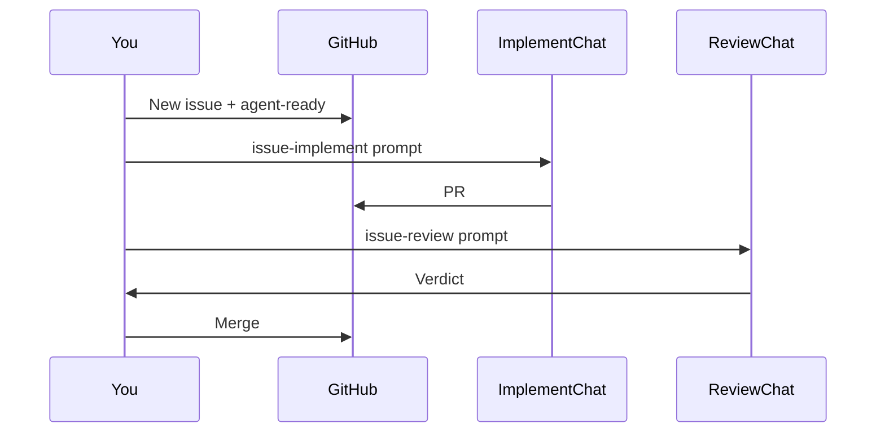

# Agent workflow tutorial

How to use Cursor agents with GitHub issues on Cutdown: **implement** then **review**. No automation required — you paste prompts when ready.

See also [AGENTS.md](../AGENTS.md) for quick prompts.

## What you need

- Cursor with this repo open
- `gh` CLI logged in (`gh auth status`)
- Git push access to `Quvvy/Cutdown`

## One-time setup

### 1. GitHub label (optional but recommended)

On GitHub → Issues → Labels → create:

- **Name:** `agent-ready`
- **Color:** anything
- **Description:** Scoped and ready for an implement agent

Only add this label when the issue has clear acceptance criteria. It does not auto-start agents — it’s a signal for you.

### 2. Skills are already in the repo

- `.cursor/skills/issue-implement/`
- `.cursor/skills/issue-review/`

Cursor loads project skills from `.cursor/skills/` automatically.

## The loop

```text
1. File issue (use "Agent task" template)
2. Add label agent-ready when scoped
3. Chat A: implement → PR
4. Chat B: review → Approve / Request changes
5. Chat A (or new): fix if needed
6. You merge when CI + review OK
```



## Step by step

### Step 1 — File an issue

GitHub → **New issue** → **Agent task**.

Fill in:

- **Summary** — one sentence
- **Acceptance criteria** — checklist the agent can verify
- **Area** — edit, export, timeline, etc.

Example:

> **Summary:** Show app version in Settings General tab  
> **Acceptance criteria:**  
> - [ ] Version string visible near "Check for updates"  
> - [ ] Matches `getVersion()` / package version  
> - [ ] `npm run validate:release` passes  

Add **`agent-ready`** when you’re happy with the scope.

### Step 2 — Implement (Chat A)

Open a **new** Cursor Agent chat on this repo.

Paste (replace `N`):

```text
Use the issue-implement skill.

Implement GitHub issue #N. Branch, validate, commit, push, and open a PR with gh.
```

Let it run. It should:

1. Read the issue
2. Create `fix/issue-N-...`
3. Make a small change
4. Run `npm run validate:release`
5. Push and open a PR

Copy the PR URL when done.

### Step 3 — Review (Chat B)

Open a **second** chat. Do not reuse the implement chat.

Paste (replace `X`):

```text
Use the issue-review skill. Review-only — do not edit files.

Review PR #X against the linked issue. Approve or request changes.
```

Read the verdict:

- **Approve** → check CI on GitHub, merge if green
- **Request changes** → go to Step 4

### Step 4 — Fix loop (back to implement)

In the implement chat (or a new one with the same skill):

```text
Use the issue-implement skill.

Address the review feedback on PR #X. Push updates to the same branch.
```

Re-run review in Chat B if the change was non-trivial.

### Step 5 — Merge

You merge on GitHub when:

- Review agent approved (or you agree with its concerns)
- [CI workflow](.github/workflows/ci.yml) is green

## Tips for effective issues

**Good issues**

- One behavior change
- Testable acceptance criteria
- Area tag set

**Bad issues**

- “Make the app better”
- Multiple unrelated requests
- No way to verify done

## Cost and safety

- **Two chats per issue** (implement + review) is intentional — cheaper than one long chat that does everything poorly
- Review chat stays readonly — no accidental edits
- One implementer per issue — no parallel agents on the same branch

## Timeline / WebView2 note

If an issue touches the timeline or `src/styles.css` layout, the implement skill asks for NSIS smoke in the PR. `tauri dev` alone has hidden layout bugs in the installed app. See [TESTING.md](TESTING.md).

## Later: automation (optional)

Not set up yet. When you want issues to auto-start agents:

- GitHub Action on `issues` labeled `agent-ready` + Cursor SDK, or
- Cursor Cloud Agents from the issue UI

Start manual until the two-chat loop feels natural.

---

## Set this up on another repo

Open the other repo in Cursor and paste this to the agent:

```text
Set up a two-agent GitHub workflow for this repo:

1. Add project skills in .cursor/skills/:
   - issue-implement: read gh issue, branch fix/issue-N-slug, minimal fix,
     run this repo's standard validate/test command, commit, push, gh pr create
   - issue-review: readonly, gh pr diff, check against issue acceptance criteria,
     output Approve or Request changes

2. Add AGENTS.md at repo root with starter prompts for implement and review.

3. Add docs/AGENT-WORKFLOW.md tutorial (manual workflow, no auto webhooks).

4. Add .github/ISSUE_TEMPLATE/agent_task.yml with summary + acceptance criteria.

5. Add a reference.md inside issue-implement with this repo's quirks
   (test command, platforms, things not to break).

Use disable-model-invocation on skills. Do not add GitHub Actions for agents yet.
Match existing commit/PR conventions in this repo.
```

The agent should read that repo’s README for the right test command (`npm test`, `pytest`, `cargo test`, etc.) and document project-specific pitfalls in `issue-implement/reference.md`.

## First practice issue

Try a docs-only issue yourself:

1. Issue: “Add link to AGENT-WORKFLOW.md from README” (if not already there)
2. Implement → PR
3. Review → merge

Low risk, full loop in under an hour.
